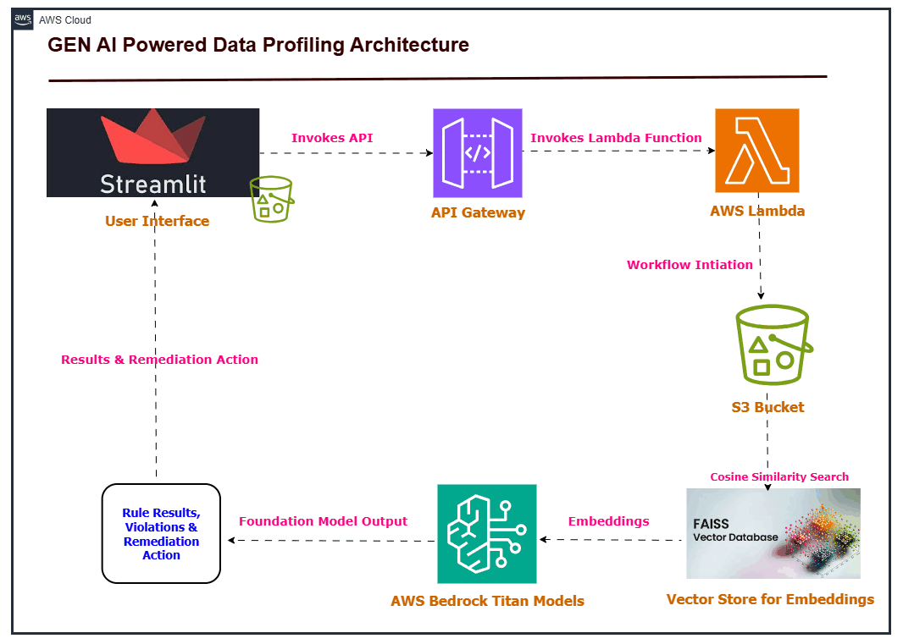

# 🚀 Regulatory Data Profiling using GEN AI

[](https://aws.amazon.com/bedrock/)
[](https://www.python.org/)
[](https://aws.amazon.com/serverless/)


Automated compliance solution that transforms regulatory documents into executable data quality rules for banking institutions.

---

## 📌 Table of Contents
1. [Project Overview](#project-overview)
2. [Key Features](#key-features)
3. [System Architecture](#system-architecture)
4. [Technology Stack](#technology-stack)
5. [AWS Services and Components](#aws-services-and-components)
6. [Prerequisites](#prerequisites)
7. [Usage Instructions](#usage-instructions)
8. [Contributing](#contributing)
9. [How we Built](#how-we-built)
10. [How to Run](#how-to-run)
11. [Challenges We Faced](#challenges-we-faced)
12. [Team](#team)

---

## Project Overview
A serverless solution that automates:
- Extraction of regulatory requirements from documents (PDF/Word)
- Generation of data validation rules using AWS Bedrock's Titan models
- Application of rules to transaction datasets
- Generation of remediation suggestions for compliance violations

---

## Key Features
- **AI-Powered Rule Generation**: Convert regulatory text to executable validation rules
- **Multi-Format Support**: Process PDF, DOCX, and CSV files
- **Serverless Architecture**: AWS Lambda-based processing pipeline
- **Compliance Dashboard**: Streamlit web interface for results visualization
- **Audit Trail**: Full documentation of rule generation process

---

## System Architecture

Regulatory Documents → AWS S3 → Text Extraction → LLM Processing → Rule Generation
↓
Transaction Data → Validation Engine → Anomaly Detection → Remediation Suggestions
↓
Streamlit Dashboard ← Results Storage



---

## 🏗️ Technology Stack
| Component          | Technology                 |
|--------------------|----------------------------|
| Document Processing| AWS Textract, PyPDF2       |
| AI/ML              | AWS Bedrock (Titan)        |
| Compute            | AWS Lambda                 |
| Storage            | Amazon S3, DynamoDB        |
| UI Framework       | Streamlit                  |
| Validation Engine  | Pandas, PySpark            |

---

## AWS Services and Components

1) **AWS Lambda** : Serverless computing for processing documents and generating rules
2) **API Gateway** : RESTful API interface for communication between components
3) **Amazon S3** : Storage for instruction documents and transaction data
4) **AWS Bedrock** : For accessing the Titan Foundation and Titan Text Embedding models
5) **Streamlit** : For building the user interface
6) **FAISS** : Vector database for efficient similarity search and embeddings storage

---

## Prerequisites
1. AWS account with Bedrock access
2. Python 3.9+ environment
3. AWS CLI configured with admin privileges
4. Minimum 2GB RAM for local testing

---

## Usage Instructions
### Step 1: Document Upload
```sh
from src.ingestion import upload_regulatory_doc

upload_regulatory_doc('path/to/regulation.pdf', bucket='your-s3-bucket')
```
### Step 2: Rule Generation
```sh
python src/rule_generation/generate_rules.py --document regulation.pdf
```
### Step 3: Data Validation
```sh
from src.application import validate_transactions
results = validate_transactions('transactions.csv', rules_version='v1.0')
```
### Step 4: View Results
```sh
streamlit run src/front_end.py
```

---

## Contributing
1. Fork the repository
2. Create feature branch:
```sh
git checkout -b feature/new-validation-method
```
3. Add tests for new features
4. Submit pull request using the template
5. Ensure all tests pass:

---

## 🎥 Demo
🔗 [Live Demo]   
🖼️ Screenshots:


## 🛠️ How We Built It
Briefly outline the technologies, frameworks, and tools used in development.

## 🚧 Challenges We Faced
Describe the major technical or non-technical challenges your team encountered.

## 🏃 How to Run
1. Clone the repository  
   ```sh
   git clone https://github.com/phanikolla/gaidp-ai-detectives.git
   ```
2. Install dependencies  
   ```sh
   npm install  # or pip install -r requirements.txt (for Python)
   ```
3. Run the project  
   ```sh
   npm start  # or python app.py
   ```

## 👥 Team
- **Phani Kumar Kolla** - [GitHub](#) | [LinkedIn](#)
- **Parikshit More** - [GitHub](#) | [LinkedIn](#)
- **Anirudh Yadav** - [GitHub](#) | [LinkedIn](#)
- **Aishwarya** - [GitHub](#) | [LinkedIn](#)
- **Issue Tracker**: [GitHub Issues](https://github.com/phanikolla/gaidp-ai-detectives/issues)  
